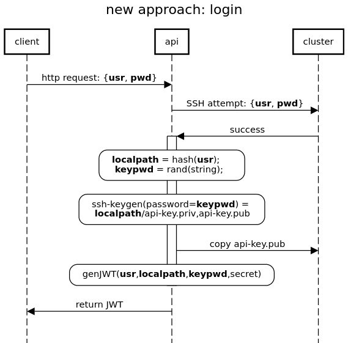
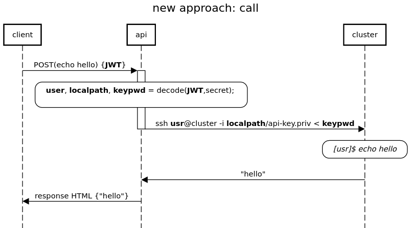

# API implementation

## Overview
**respository**: [https://github.com/daviderovell0/resop/](https://github.com/daviderovell0/resop/)

**resop** is written in pure JavaScript and depends on some npm modules. Dependencies are listed in `package.json`.

## Components
We can split resop in 3 categories: API logic, backend and operators.

#### API logic
```
# files involved:
api.js
env.js
auth.js
routes/*
```
**resop**'s API logic is built with [Express](http://expressjs.com/). 

The main idea is that endpoints representing commands and operations are not implemented in the routes, instead they  define "general" endpoints that are imported dynamically from the operators, via the backend functions. 
#### Backend
```
# files involved :
backend/*
```
The classes Command and Operation provide methods to define respective actions. They make calls to the SSH client (`SSH2Agent`) class to perform remote operations on behalf of the authenticated user. Respective *Utils classes are used to import commands and operations defined in the `operators` folder.
#### Operators
```
# files involved:
operators/*
```
This is where the actual actions are defined: only this section needs to be edited when creating new API commands or operations, the API will import them automatically if their definition is correct and if the folder structure is respected. See [here](/resop-docs/use/customise) for more information on how to add new actions.
## Authentication
**resop** is stateless: everytime a user attempts authentication, resop attempts to connect via SSH to the remote cluster with the credentials given by the user. 

If the login is successful, it will generate a private/public keypair and map it to a JSON Web Token, which is return to the user. This allows the user, token owner to use the API and therefore access the remote cluster with the authenticated user credentials.

Diagrams below outline the authentication process in detail.

|  |
| :--: |
| Successful authentication workflow: (1) Generate a public + (encrypted) private keypair - (2) copy the public key to the remote cluster - (3) store the private key locally, in the path set in the configuration file. The key name is generated by encrypting the username. Successive successful login attempts will therefore replace the existing key, making sure *only one private key* is stored at a time. - (4) Encode the generate private key passphrase, private key name and username into the JSON Web Token (JWT) - (5) Return the JWT to the user |

|  |
| :--: |
| When the API receives a call, it reads the token embedded in the request. If valid, it extracts the informations that it needs to locate the key, unlock it and use it to SSH to the remote cluster with the username. It then runs the command/script and returns the response |

