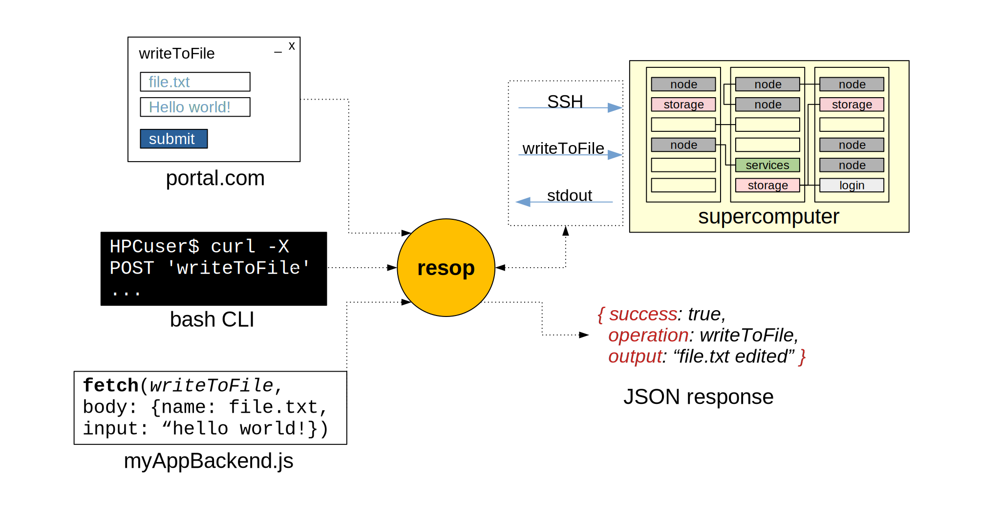

# **resop**: **re**mote **s**hell **op**erational API

**resop** is a RESTful API to manage user, admin, job, (any) *shell* operations in a remote Linux cluster. It is specifically targeted to a supercomputer / HPC cluster but it can be used for any machine accessible via SSH.

It is:

- A thin layer over classic HPC (and not) Linux clusters to make them easily accessible to third party applications, or anything talking HTTP.
- An SSH client with a library of common HPC commands and operations
- A tool to turn your long, manual command routines into a single POST request.

|  |
|:--:|
| High-level interaction diagram of the resop API and some typical applications |

## Features
- Run remote **Linux shell commands** through **HTTP** directly to a remote cluster and get a JSON response.
- Commands and arbitrary JavaScript are chained together to create more complex **Operations** that can be run in the same way as commands.
- A library of operations of typical HPC commands and routines is organized into operators. Some examples: **slurm, ldap, utils**
- *Simple customisation*: you can implement custom operations without dealing with API logic. Just create a JavaScript file using the provided class, list series of commands or use JavaScript power for server-side operations such as parsing strings.
- *Secure commands and operations*: every endpoint is accessed prior token-based authentication and will run remote operations with the privildeges of the corresponding authenticated user.  
- *Quick setup*: NodeJS and MariaDB* are the only dependencies, one file configuration and the API is ready to be used
- *Run anywhere*: resop is **stateless** and uses remote SSH authentication so it can be hosted anywhere that has access to the HPC cluster 
- *Connect 3rd party apps*: as any other RESTful API, you can easily connect to web or destop apps (portals, IDEs, local CLI apps etc.). Call the API from any programming language -> read the result -> done!

<sub><sup>*only needed if the logging feature is enabled</sup></sub>

## Use-cases

#### Administration routines 
I am a admin of an HPC center and I want to automate some recurrent operations that are done manually. 

In order to create or delete a user, I need to update different services: the system user database (LDAP), the scheduler database (Slurm) and the database for the online portal for remote visualization (PostgresSQL). The procedure to create an account becomes:
```bash
$ ssh admin@hpccenter # ssh into the system
$ vim new_user.ldif # write user details to LDIF 
$ ldapadd -f new_user.ldif # add the new user the LDAP database
$ sacctmgr create user ... # add the user to slurmdbd
# go to the web portal and add the new user 
```
With resop, I can group all this steps into a custom operation in my custom operator that I call: hpccenter->createUser. I will then just call:
```bash
curl -X POST -d "username=value1&password=value2" https://resop:3000/hpcuser/opn/createUser
```
Or I can call the API endpoint from within a basic HTML form page, or put it in a script on my local machine

#### Developer 
I am developing a portal to facilitate user access to "HPCcluster" and I want to display a monitoring graphical interface showing available nodes with hardware information displayed when clicking on a node. 

I can fetch all the infomation by calling resop from the portal backend, for instance, by calling the batch scheduler (such as Slurm) informative command. I will then receive a JSON object as a response that I can parse and use for my graphical interface. This approach is language-neutral so it is compatible with any programming language my application is written in. 

If the functionality that I need it is not in resop library, I can also implement my personal operation in resop, in a single JavaScript file. 
#### HPC user / researcher

I am an HPC user that needs to run a batch of simulations with different initial conditions. I can use resop to submit multiple jobs from my machine using [postman](https://www.postman.com/) or other tools that facilitate the interaction with an API, without having to connect to the cluster directly. 

(in future versions) I use the loggin functionality of the API to keep track of my past simulations and organize them. 