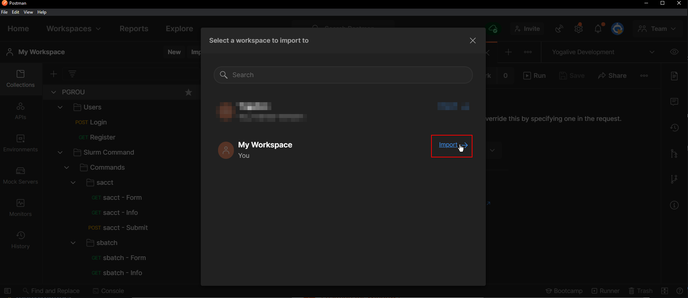
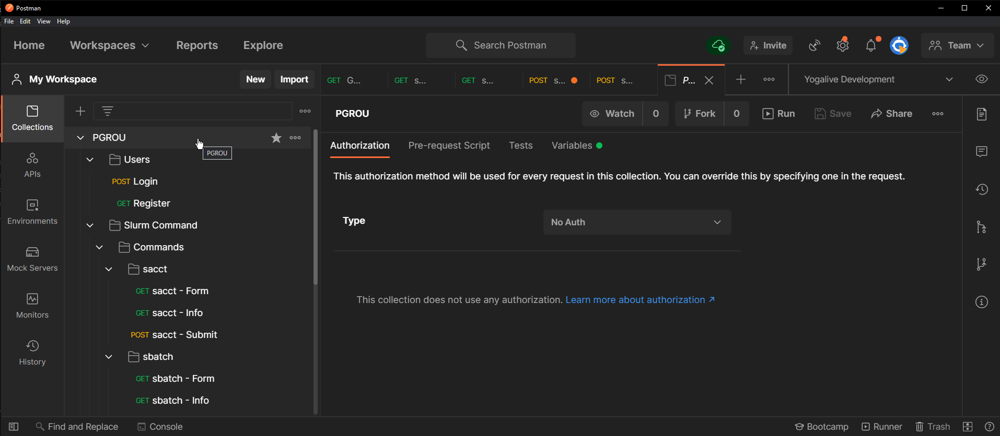

# Reference
The API reference to all the available endpoints implemented is built and tested with [Postman](https://www.postman.com/).

## Postman

The live reference for the API can be found on:
[https://documenter.getpostman.com/view/19947146/VUjHNoik](https://documenter.getpostman.com/view/19947146/VUjHNoik)

To import the library to Postman for usage, test and development, you can simply open the URL above and click on "Run in Postman". It'll ask you to download Postman but once that is done, you'll see the following:

Click and import and on the next screen you'll find the postman collection:

