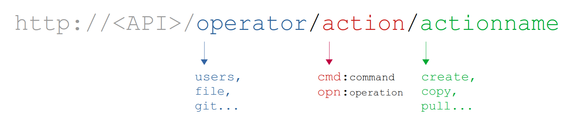

# Overview
The purpose of this API is to perform (customisable) "actions" onto a remote HPC cluster. There are 2 types of possible actions: *commands* and *operations*:

- **Command**: a single, atomic shell command such as `cp a.txt b.txt`
- **Operation**: a more complex action that could consist in several commands followed by some logic, such as taking the ouput of the first command, processing it and feeding into stdin of the second command.

Both actions can belong to a specific **operator**: a group of *commands* and *operations* that have common utility.

All endpoints implementing commands and operations follow this structure:



All API communcation is done via JSON format.

## Command
Three types of HTTP requests are available for a command: 
#### GET `{API}/{operator}/commands`
Lists all the supported commands for the given {operator}

#### GET `{API}/{operator}/cmd/:{command}`
Fetches a single {command} info and supported options for the given {operator} 

#### POST `{API}/{operator}/cmd/:{command}`
Runs the actual command. Options, such as flags and stdin arguments can be defined in the POST body, such as:

```json
{
  "input": "input",
  "options1": "value",
  "options2": "value",
  ...
}
```

Supported commands with the appropriate flags and options are defined via YAML. All commands for a given operator are defined in `operators/{operator}/commands.yml` in the source code, Check ?? for more info on how commands are defined and the reference (or source code!) for a list of all operators.

## Operations
Three types of HTTP requests are available for an *operation*: 
#### GET `{API}/{operator}/operations`
Lists all the supported operaions for the given {operator}

#### GET `{API}/{operator}/opn/:{operation}`
Fetches a single {operation} info and supported options for the given {operator} 

#### POST `{API}/{operator}/opn/:{operation}`
Runs the actual operation. Options can be defined in the POST body in the same way as commands:

```json
{
  "input": "input",
  "options1": "value",
  "options2": "value",
  ...
}
```

Supported operations with options are defined via JavaScript files named after the *operation*. All operations for a given operator are defined in `operators/{operator}/operations/{myOperation}.js` in the source code. <br> Check ?? for more info on how commands are defined and the reference (or source code!) for a list of all operators.

## User and authentication important notes
Any endpoint is run by a specific user  onlyafter successful authentication to the API.  It follows that, to avoid security and unwanted identity appropriation:
```
API username == cluster username
```
API admins must ensure that the above statement is respected by using or implementing user management methods appropriate for their system.

##### Example 1
`{{API}}/user/opn/createClusterUser` in a system with LDAP-based authentication should create a user in LDAP at the same time as a user in the API database.

##### Example 2
The bundled operation `db/opn/createUser` is used only after successful user creation in the HPC cluster.